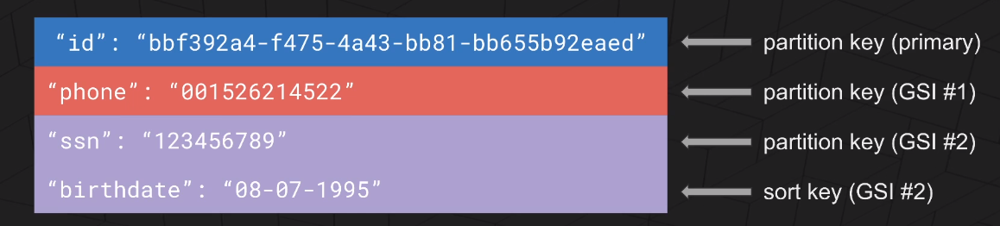
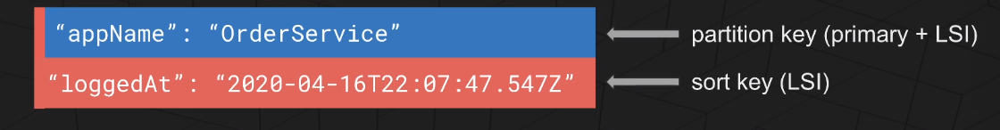

# serverless-framework-bootcamp

Serverless Framework Bootcamp

## Setup project using serverless framework

```
sls create --name YOUR_PROJECT_NAME --template-url https://github.com/codingly-io/sls-base

cd YOUR_PROJECT_NAME

npm install

```

## Serverless Framework Commands

- sls deploy -v
- sls remove -v
- sls deploy -v -f function-name

## Lambda

- The function should return response in format below:

```
  return {
  statusCode: 200,
  body: JSON.stringify({ message: "Hello Serverless Framework..." }),
  };

```

- The body should be stringified. Else an error will be thrown.

- Missing execution permission for Lambda function results in below error. Refer Cloudwatch logs for more details.

  ```
  502 Bad Gateway

  {
      "message": "Internal server error"
  }
  ```

## DynamoDB

- Table, Items, attributes
- Scan Vs Query
  - Scan : Scans entire table. Scans through each individual item in the database
  - Query : Based on Primary or Secondary Index
- Primary Key : Uniquely identifies an item in the table. 2 types of Primary keys
  - Partition Key : A simple primary key composed of one unique attribute. Eg: UserId
  - Composite Primary Key (Parititon Key and Sort Key) : Composed of 2 attrbutes. The first one is the Partition Key and second being the Sort Key. Eg: authorId is partition key and postedAt is sort key
- Secondary Indexes : Allows more querying flexibility in the table. We can create 1 or more secondary indexes for a table. We can use other keys different from Primary Key. 2 Types of Secondary Index
  - Global Secondary Index : An index with a Partition Key and Sort Key that can be different from those on the table. 20 GSI can be created per table.
    
  - Local Secondary Index : An index that has the same Partition Key as the table but a different Sort Key
    
- Read Consistency :
  - Eventual Consistent Reads : The response mihgt not reflect the results of a recently completed write operation
  - Strongly Consistent Reads : The response will reflect most up-to-date data
    - Potential higher latency
    - Not supported on Global Secondary Indexes
    - Use more throughput capacity
- Read/Write Capacity Modes
  - On-Demand mode :
    - Flexible
    - Capable of serving thousands of requests per second
    - No need to plan your capacity ahead-of-time
    - Pay-per-request basis - only pay for what you use
    - Elastically adapting to your workload
    - Delivery time usually single-digit millisecond latency (SLA)
  - Provisioned mode:
    - Read and Write capacity per second needs to be specified
    - Can specify auto-scaling rules to automatically adjust he capacity
    - Allows you to reserve capacity in advance, reducing the costs significantly
    - Capacity specified as Read Capacity Units (RCU) and Write Capacity Units (WCU)
    - 1 RCU = (1 Strongly Consistent Read per second) or (2 Eventual Consistent Reads per second), for upto 4KB in size
    - 1 WCU = 1 Write per second, for an item upto 1KB in size
- DynamoDB streams
  - An optional feature that allows to react on new item creation, updateor deletion on the Table
